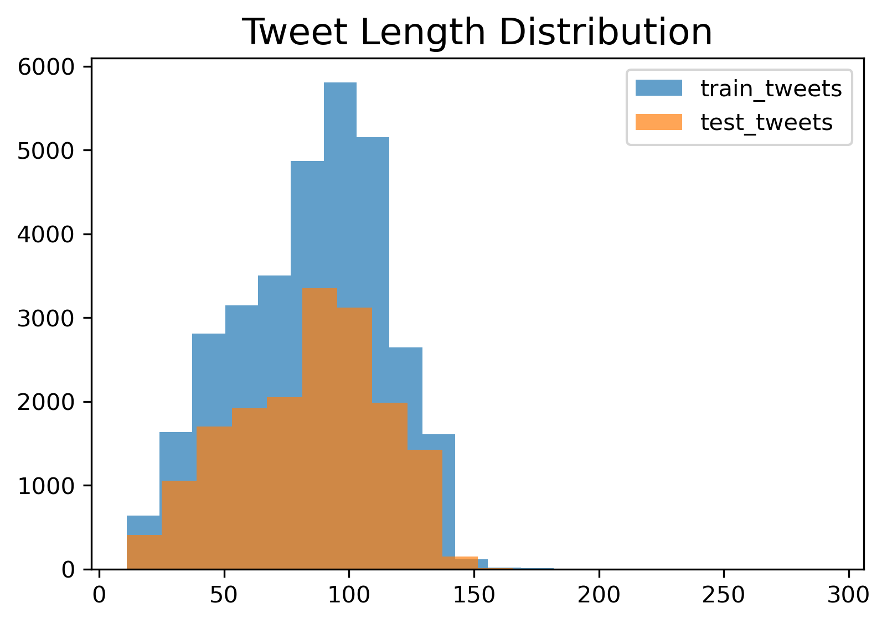
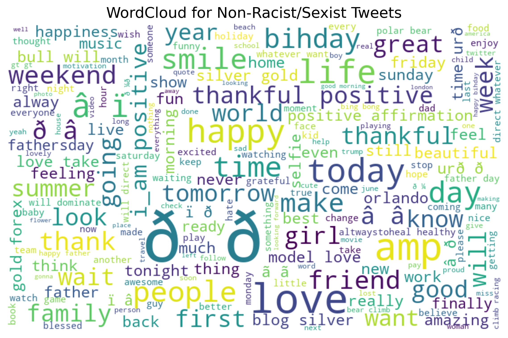
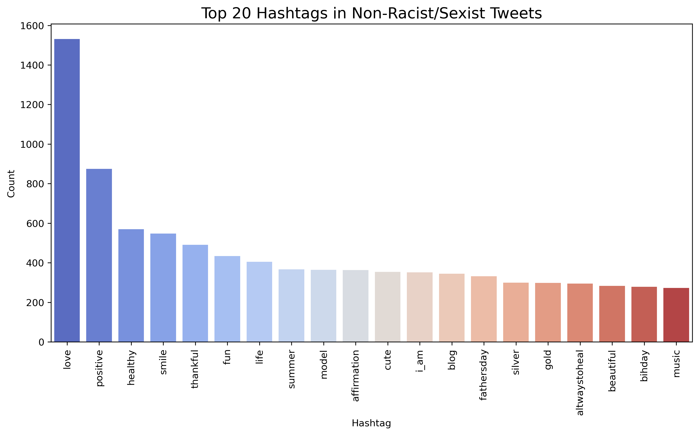
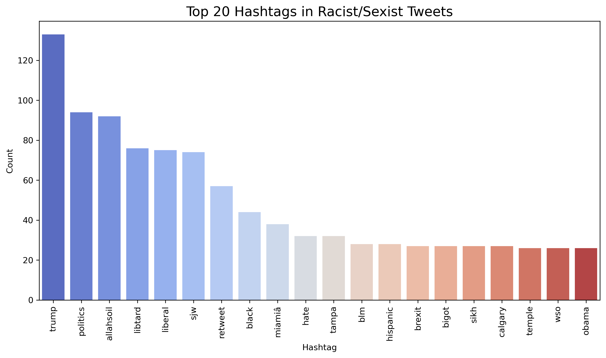

# Twitter Sentiment Analysis: Practice Problem
## Problem Statement

The objective of this task is to detect hate speech in tweets. For simplicity, a tweet is considered to contain hate speech if it has racist or sexist sentiment associated with it. The task is to classify tweets into two categories: those that are racist or sexist and those that are not.

Formally, given a training dataset of tweets and their corresponding labels:
- Label `1` indicates the tweet is racist or sexist.
- Label `0` indicates the tweet is not racist or sexist.

The goal is to build a model that can accurately predict the labels for a test dataset of unlabeled tweets. 

This is an imbalanced classification problem, as the majority of tweets in the training data are non-hateful, with only a small percentage containing hate speech. Therefore, models need to account for this imbalance while being evaluated based on metrics like F1-score to ensure they perform well on the minority class (hate speech).
## Table of Contents

- [Data Exploration](#data-exploration)
- [Text Preprocessing and Cleaning](#text-preprocessing-and-cleaning)
- [Feature Extraction](#feature-extraction)
- [Model Building](#model-building)
- [Model Tuning](#model-tuning)
- [Results](#results)
- [Visualizations](#visualizations)

---

## Data Exploration

### Tweet Length Distribution

The following histogram shows the distribution of tweet lengths in both the training and test datasets. The distributions are quite similar, indicating that the datasets are consistent in terms of tweet length.

### Label Distribution

In the train dataset:
- 2,242 (~7%) tweets are labeled as racist/sexist.
- 29,720 (~93%) tweets are labeled as non-racist/sexist.

This indicates an imbalanced classification challenge.

---

## Text Preprocessing and Cleaning

We performed several steps to clean and preprocess the text data:

1. **Removing Twitter Handles (@user)**: Removed all mentions of users in the tweets.
2. **Removing Punctuations, Numbers, and Special Characters**: Only alphabetic characters were retained.
3. **Removing Short Words**: Words with less than 3 characters were removed.
4. **Stemming**: Reduced words to their root forms using stemming.

---

## Feature Extraction

### Word Clouds

Word clouds help visualize the most frequent words in the tweets. Larger words indicate higher frequency.

- **Non-Racist/Sexist Tweets Word Cloud**:
  

- **Racist/Sexist Tweets Word Cloud**:
  

### Top Hashtags

Hashtags provide insights into the common topics discussed in the tweets.

- **Top Hashtags in Non-Racist/Sexist Tweets**:
  

- **Top Hashtags in Racist/Sexist Tweets**:
  

---

## Model Building

We built models using several algorithms:
- Logistic Regression
- Support Vector Machine (SVM)
- Random Forest
- XGBoost

### Feature Sets

We used different feature sets for model training:
- Bag-of-Words (BoW)
- TF-IDF
- Word2Vec Embeddings
- Doc2Vec Embeddings

---

## Model Tuning

We fine-tuned the XGBoost model by optimizing the following hyperparameters:
- `max_depth`
- `min_child_weight`
- `subsample`
- `colsample_bytree`
- `eta`
- `gamma`

---

## Results

### Logistic Regression Model
- **Validation F1 Score**: 0.526
- **Precision**: 0.66
- **Recall**: 0.44
- **Accuracy**: 0.94

### XGBoost Model
- **Validation F1 Score**: 0.417
- **Precision**: 0.72
- **Recall**: 0.29
- **Accuracy**: 0.94

---

## Visualizations

#### Tweet Length Distribution

#### Word Clouds
- **Non-Racist/Sexist Tweets Word Cloud**:
  

- **Racist/Sexist Tweets Word Cloud**:
  

#### Top Hashtags
- **Top Hashtags in Non-Racist/Sexist Tweets**:
  

- **Top Hashtags in Racist/Sexist Tweets**:
  

---

This project demonstrates the process of building and evaluating machine learning models for detecting hate speech in tweets. The visualizations provide insights into the common words and hashtags used in different categories of tweets. The Logistic Regression model performed better compared to the initial XGBoost model on the validation set, but further tuning may improve results.

For more details on the implementation and analysis, refer to the accompanying Jupyter Notebook.
